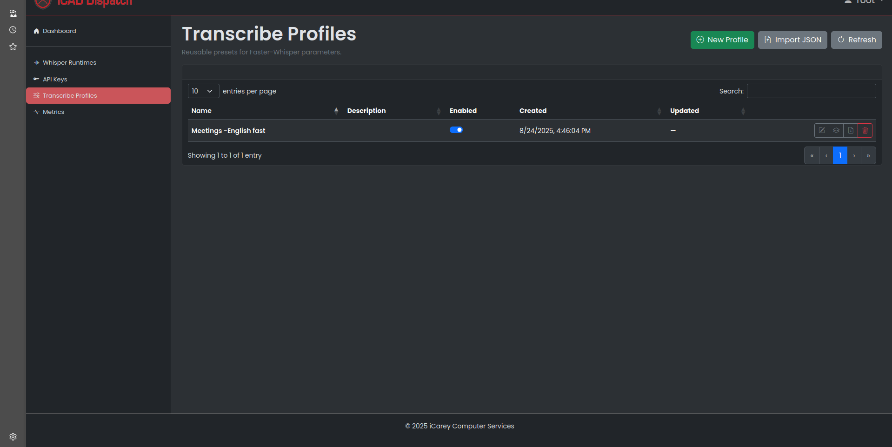
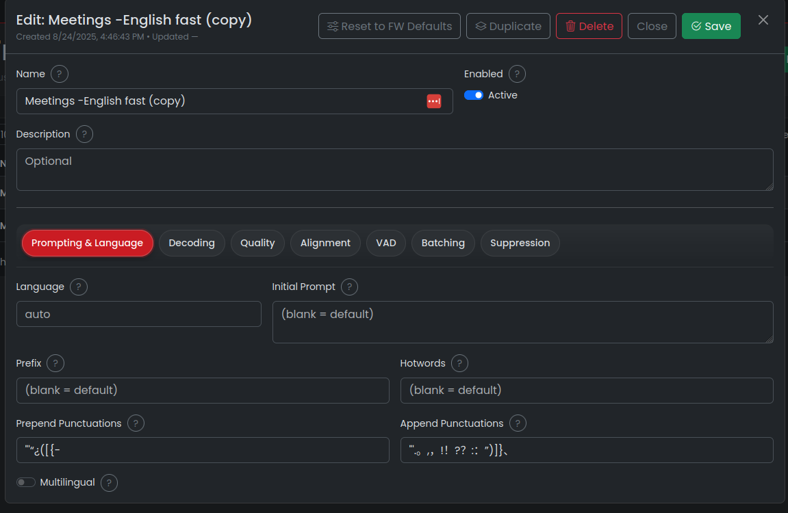

# PROFILES

**Transcribe Profiles** are presets of Faster-Whisper / OpenAI-style transcription knobs. Save a named configuration once and reuse it at request time—no need to send parameters on every call.

Profiles are:
- Named (names must be unique in your account)
- Enabled/Disabled (only enabled profiles are usable)
- **Authoritative**: when a profile is applied, its parameters **replace** any request-level parameters

---

## How profiles are applied at request time

### Selector format

Pass a `model` (OpenAI-compatible routes) or `runtime` (native routes) **selector** in the form:

`<runtime_or_model>|<profile_selector>`

- Left of `|` = runtime/model identifier (name or id)
- Right of `|` = **profile selector** (either profile **name** or numeric **profile id**)
- If the left side is omitted, the server uses the **default runtime**

Resolution steps:
1. The server resolves the **runtime** from the left side (or uses the default runtime if omitted).
2. If a profile selector is present, the profile is loaded:
  - All-digits selector → lookup by id
  - Otherwise → case-insensitive lookup by **name**
  - Only **enabled** profiles are usable
3. If found, the profile’s parameters are loaded and any request form/query parameters are **ignored**.

If not found, the server responds with:

- **404** `profile_not_found` — “Profile `<selector>` not found for this API key.”

Other runtime/model selection errors you might see first:

- **400** `model_ambiguous` — runtime/model name matched multiple candidates
- **404** `model_not_found`
- **503** — no default runtime configured/loaded (when none specified)

### Endpoints that support profiles

- Native:
  - `POST /api/transcribe`
  - `POST /api/transcribe/stream`
- OpenAI-compatible:
  - `POST /v1/audio/transcriptions`
  - `POST /v1/audio/transcriptions/stream` *(extension)*
  - `POST /v1/audio/translations`
  - `POST /v1/audio/translations/stream` *(extension)*

The selector is read from:
- `runtime` **or** `model` (form field or query string). If both are sent, `runtime` is preferred.

#### Example calls

- By **profile name** (OpenAI route):

```bash
curl -sS -X POST http://HOST:PORT/v1/audio/transcriptions \
-H "Authorization: Bearer $API_KEY" \
-F "model=whisper-large-v3|Meetings – English fast" \
-F "file=@/path/to/audio.wav"
```

- By **numeric profile id** (native route):

```bash
curl -sS -X POST http://HOST:PORT/api/transcribe \
-H "Authorization: Bearer $API_KEY" \
-F "runtime=default|12" \
-F "file=@/path/to/audio.wav"
```

> When a profile is present, any request parameters (temperatures, VAD, etc.) are **ignored** in favor of the stored preset.

---

## Using the Dashboard editor

**Location:** *Dashboard → Transcribe Profiles*



### List view
- Search/sort with the table header
- Toggle **Enabled** inline (switch)
- Row actions:
  - **Edit**
  - **Duplicate**
  - **Export JSON**
  - **Delete** (with confirm)

### Creating & editing
- Click **New Profile** or **Edit** on an existing row
- The editor opens with tabs:
  - *Prompting & Language*, *Decoding*, *Quality*, *Alignment*, *VAD*, *Batching*, *Suppression*
- **Save** to persist. Unsaved changes are guarded if you try to close.



**Editor header buttons**
- **Reset to FW Defaults** — fills common fields with Faster-Whisper defaults shown as placeholders
- **Duplicate** — makes a copy (available for existing profiles)
- **Delete** — removes the profile

### Import / Export

- **Export JSON** saves:
  - `name`, `description`, `enabled`, and `params` (only non-empty values)
- **Import JSON**:
  - Prompts for a **unique name** (the UI enforces uniqueness and handles conflicts)
  - Imported profiles appear in the list; you can edit them later

**Export / Import shape example:**

```json
{
    "name": "Meetings – English fast",
    "description": "Optimized for English calls; faster decoding with VAD.",
    "enabled": true,
    "params": {
        "language": "en",
        "temperatures": [0.0, 0.2, 0.4],
        "beam_size": 5,
        "best_of": 5,
        "no_repeat_ngram_size": 0,
        "patience": 1.0,
        "length_penalty": 1.0,
        "repetition_penalty": 1.0,
        "compression_ratio_threshold": 2.4,
        "log_prob_threshold": -1.0,
        "no_speech_threshold": 0.6,
        "prompt_reset_on_temperature": 0.5,
        "max_initial_timestamp": 1.0,
        "multilingual": false,
        "suppress_blank": true,
        "condition_on_previous_text": true,
        "suppress_tokens": [-1],
        "without_timestamps": false,
        "word_timestamps": false,
        "vad_filter": true,
        "vad_threshold": 0.5,
        "vad_min_silence_duration_ms": 2000,
        "vad_speech_pad_ms": 400,
        "clip_timestamps": "0",
        "prepend_punctuations": "\"'“¿([{-",
        "append_punctuations": "\"'.。,，!！?？:：”)]}、"
    }
}
```

> Fields not present in the UI but supported by the backend (e.g., `language_detection_segments`, `language_detection_threshold`) can be provided via JSON import and will be stored/used, but they are not editable in the modal.

---

## Request precedence rules (important)

- **With a profile**: all request-level knobs are ignored; the profile defines the **entire** parameter set passed to the engine.
- **Without a profile**: request form/query parameters are converted to Faster-Whisper kwargs.
- For `/api/transcribe` (non-OpenAI) JSON responses, **`without_timestamps` defaults to `True`** unless explicitly set (profile or request).

---

## Parameter reference

Below are the parameters visible in the editor today, plus when/why to change them.

### Prompting & Language

- **`language`**  
  BCP-47 code (e.g. `en`). Leave blank to auto-detect.  
  *When to set:* known single-language audio for faster, more stable decoding.

- **`initial_prompt`**  
  Text considered before the first segment; biases terminology/style.  
  *When to set:* domain vocabulary, names, acronyms.

- **`prefix`**  
  Forces the next segment to start with this string.  
  *When to set:* continuing from known context or enforcing a leading token.

- **`hotwords`**  
  Comma-separated phrases to bias decoding toward domain terms.  
  *When to set:* product names, jargon.

- **`multilingual`**  
  Enable multilingual mode.  
  *When to set:* non-English or mixed language audio; leave off for English-only models.

- **`prepend_punctuations`**  
  Characters allowed immediately **before** a word (placeholder: `"\"‘“¿([{-"`).  
  *When to adjust:* language-specific punctuation rules.

- **`append_punctuations`**  
  Characters allowed immediately **after** a word (placeholder: `"\"'.。,，!！?？:：”)]}、"`).  
  *When to adjust:* language-specific punctuation rules.

---

### Decoding

- **`temperatures`**  
  One value or a list tried progressively if decoding stalls (e.g. `0.0,0.2,0.4,0.6,0.8,1.0`).  
  *When to adjust:* raise to encourage exploration; provide a ladder for robustness.

- **`beam_size`** (int)  
  Number of beams in beam search (default placeholder `5`).  
  *Trade-off:* larger = better accuracy, slower.

- **`best_of`** (int)  
  Keep N best sampled candidates (default placeholder `5`).  
  *Trade-off:* higher can improve quality with sampling strategies.

- **`patience`** (float)  
  Beam search stopping criterion (default `1.0`).  
  *When to adjust:* increase slightly for tough audio to improve completeness.

- **`length_penalty`** (float)  
  `>1` favors **shorter** outputs; `<1` favors **longer** (default `1.0`).  
  *When to adjust:* tune verbosity.

- **`repetition_penalty`** (float)  
  Penalize repeated tokens to reduce loops (default `1.0`).  
  *When to adjust:* increase to combat repetition artifacts.

- **`no_repeat_ngram_size`** (int)  
  Prevent repeating n-grams of this length (default `0` = disabled).  
  *When to adjust:* set to `3` or `4` to curb phrase loops.

- **`max_new_tokens`** (int)  
  Truncate generated tokens.  
  *When to set:* bound very long utterances; leave blank for model default.

---

### Quality / Thresholds

- **`compression_ratio_threshold`** (float, default `2.4`)  
  Reject overly compressed/hallucinated text.  
  *When to adjust:* lower to be stricter; raise if false positives.

- **`log_prob_threshold`** (float, default `-1.0`)  
  Lower bound for average log probability per token.  
  *When to adjust:* raise to reject low-confidence outputs.

- **`no_speech_threshold`** (float, default `0.6`)  
  If initial silence confidence exceeds this, skip transcription.  
  *When to adjust:* increase for silence-heavy inputs.

- **`hallucination_silence_threshold`** (float or blank)  
  Stop after prolonged silence to avoid hallucinations.  
  *When to set:* long tail silence causing trailing nonsense.

- **`prompt_reset_on_temperature`** (float, default `0.5`)  
  If `temperature ≥ value`, reset prompt each step.  
  *When to adjust:* stabilize decoding when using high temperatures.

---

### Alignment / Timestamps

- **`without_timestamps`** (bool)  
  Omit timestamps entirely.  
  *When to set:* pure text output only (faster).

- **`word_timestamps`** (bool)  
  Per-word timing (slower).  
  *When to set:* precise alignment needs (subtitle editors).

- **`max_initial_timestamp`** (float, default `1.0`)  
  Latest allowed first segment timestamp.  
  *When to adjust:* constrain initial offset.

- **`clip_timestamps`** (JSON array or sentinel `"0"`)  
  `"0"` disables clipping. JSON ranges like `[[0,30],[60,120]]` keep only those spans.  
  *When to set:* extract specific time windows.

---

### VAD (Silero)

- **`vad_filter`** (bool)  
  Apply voice activity detection pre-segmentation to remove long silences.  
  *When to set:* phone calls/meetings with long pauses.

- **`vad_threshold`** (float, default `0.5`)  
  Speech probability above this is considered speech.

- **`vad_neg_threshold`** (float or blank)  
  Below this is always silence; helps smooth transitions.  
  *When to set:* noisy inputs; set a lower bound for non-speech.

- **`vad_min_speech_duration_ms`** (int, default `0`)  
  Final speech chunks shorter than this are discarded.

- **`vad_max_speech_duration_s`** (float or blank)  
  Very long speech chunks are split at nearby silence.

- **`vad_min_silence_duration_ms`** (int, default `2000`)  
  Wait this long at end of speech before separating.

- **`vad_speech_pad_ms`** (int, default `400`)  
  Pad each final speech chunk on both sides.

---

### Batching

- **`chunk_length`** (int or blank)  
  Optional chunk size (seconds) for batched processing.

- **`batch_size`** (int or blank)  
  Number of chunks processed per batch (batched pipeline only).

---

### Suppression / Conditioning

- **`suppress_blank`** (bool; default on)  
  Suppress blank tokens to reduce empty outputs.

- **`condition_on_previous_text`** (bool; default on)  
  Condition decoding on the previously generated text.

- **`suppress_tokens`** (JSON or comma list)  
  Use `-1` to apply Faster-Whisper’s non-speech token set.  
  *When to adjust:* fine-tune which tokens are disallowed.

---
